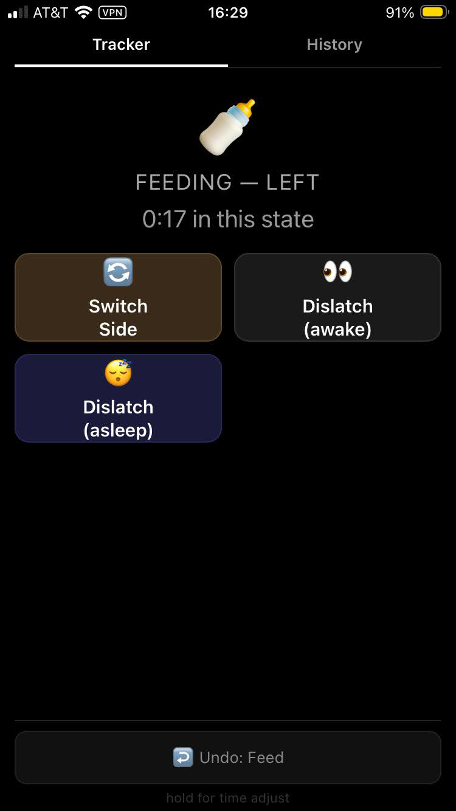

# Boob O'Clock

A nighttime baby sleep and feed tracker for breastfeeding parents. Built for one-handed use at 3am on a small phone screen.

Dark mode only. Single tap to record events. Long-press for time adjustments. No accounts, no cloud, no ads — just your data on your network.

## What it tracks

The app models your night as a state machine. Depending on the current state, only the valid next actions are shown:

- **Feeds** — start, switch breast (auto-flips), dislatch (awake or asleep). Tracks left/right duration separately.
- **Sleep** — on me, in crib, in stroller. Tracks where the baby is sleeping.
- **Transfers** — crib transfer attempts with deferred outcome (tap result when hands are free).
- **Resettling** — in-crib settling without a feed.
- **Strolling** — the nuclear option when the crib isn't working.
- **Diaper changes** — because shit happens, at any time.

## What it reports

- Per-night summary: total sleep, total feed time, wake count, feed count, longest sleep block
- Color-coded timeline bar showing the night at a glance
- Full event log with timestamps
- Trend charts with 3-night moving averages: longest sleep, total sleep, wake count, feed count, total feed time, feed time by breast (L/R)
- CSV export for backup or analysis

## Screenshots

<p align="center">
  
  
  
</p>

## Deploy

### Docker (recommended)

```bash
docker build -t boob-o-clock .
docker run -d \
  --name boob-o-clock \
  --restart unless-stopped \
  -p 8080:8080 \
  -v boc-data:/data \
  boob-o-clock
```

To change the port, set the `PORT` environment variable:

```bash
docker run -d -e PORT=9090 -p 9090:9090 -v boc-data:/data boob-o-clock
```

The SQLite database is stored in the `/data` volume. Back it up with:

```bash
docker cp boob-o-clock:/data/boob-o-clock.db ./backup.db
```

### Binary

Requires Go 1.25+ and Node 22+.

```bash
cd web && npm install && cd ..
make build
./boob-o-clock -addr :8080 -db ./boob-o-clock.db
```

### Access from your phone

Open `http://<your-server-ip>:8080` in Safari and tap **Share → Add to Home Screen**. The app launches fullscreen like a native app.

> **Note:** The PWA service worker requires HTTPS on non-localhost. For local network use, accessing via IP on HTTP works fine — you just won't get offline caching. To enable HTTPS, put a reverse proxy (Caddy, nginx) in front with a self-signed or Let's Encrypt cert.

## Develop

```bash
# Install frontend dependencies
cd web && npm install && cd ..

# Run Go backend on :8080 and Vite dev server on :5173
make dev

# Open http://localhost:5173 — hot reload for frontend, API proxied to Go
```

### Test

```bash
make test              # Go tests (109 tests across 4 packages)
cd web && npx tsc      # TypeScript type check
```

### Project structure

```
├── cmd/server/          Entry point, wiring, embed
├── internal/
│   ├── domain/          State machine (10 states, 28 transitions, zero deps)
│   ├── store/           SQLite persistence (pure Go, no CGo)
│   ├── reports/         Stats, timelines, trends, breast tracking
│   ├── api/             REST handlers
│   └── web/             Embedded frontend (go:embed)
└── web/                 Preact + TypeScript + Vite source
```

### API

| Method | Path | Description |
|--------|------|-------------|
| GET | `/api/session/current` | Current state + valid actions |
| POST | `/api/session/event` | Record an event |
| POST | `/api/session/undo` | Undo last event |
| GET | `/api/nights` | Night list with stats |
| GET | `/api/nights/:id` | Night detail with timeline |
| GET | `/api/trends` | Trend data with moving averages |
| GET | `/api/export/csv` | Download all events as CSV |
| GET | `/healthz` | Health check (DB ping) |

## License

MIT
