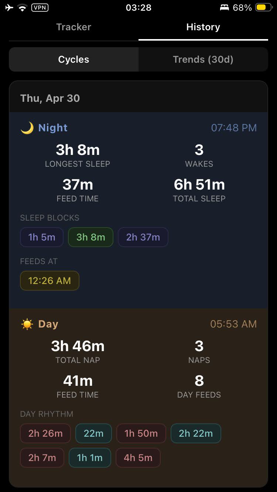

# Boob O'Clock

A self-hosted, open-source 24-hour baby sleep and feed tracker for breastfeeding parents. No account, no cloud — your data stays on your network. Built for one-handed use on a small phone screen.

Dark mode only. Single tap to record events. Long-press for time adjustments.

<p align="center">
  
  
  
</p>

## Why I built this

It started in the thick of newborn nights. At 3am, mid-feed, I genuinely could not remember which side and when I'd last fed on — and every baby tracker I found wanted an account, cloud sync, and a bright white screen in my face. So I vibecoded this for myself in a few evenings, and it's already been useful enough that I wanted to share it.

As the baby got older, more questions came up alongside the old ones. Middle of the night: "which side last?" During the day: "how long has the baby been awake?" and "was that nap 20 minutes or 45?" So the app grew a day mode — same state-machine approach, now covering the full 24-hour rhythm.

If Boob O'Clock helped you survive the infant days and nights, you can [buy me a coffee](https://ko-fi.com/polinaturcu) — it means a lot.

## What it tracks

The app models your day and night as a single state machine. Depending on the current state, only the valid next actions are shown:

### Night
- **Feeds** — start, switch breast (auto-flips), dislatch (awake or asleep). Tracks left/right duration separately.
- **Sleep** — on me, in crib, in stroller. Tracks where the baby is sleeping.
- **Transfers** — crib transfer attempts with deferred outcome (tap result when hands are free).
- **Self-soothing** — baby put down awake or stirring in crib, settling without intervention.
- **Resettling** — in-crib settling without a feed.
- **Strolling** — the nuclear option when the crib isn't working.
- **Diaper changes** — log a poop from any state without losing context.
- <a id="ferber-mode"></a>**Ferber mode** _(off by default)_ — graduated check-in intervals (classic Ferber table), mood tracking (quiet / fussy / crying), and a countdown on the check-in button so you never check in too early. I tried it — the feature worked fine; the method, not so much. Set `FERBER_ENABLED=true` to opt in (no rebuild needed); toggle off any time — past Ferber data stays in the DB and reappears when you turn it back on.
- <a id="chair-mode"></a>**Chair mode** _(off by default)_ — gentle sleep-training where the parent sits in the room while baby falls asleep. On chair nights, "put down awake" is replaced with "sit in chair" — tap when you settle into the chair, then "Settled!" when baby's asleep or "Give up" to abandon. Time-in-state and time-since-feed render live so a partner can glance from across the room. Set `CHAIR_ENABLED=true` to opt in.

### Day
- **Day feeds** — same feed tracking as night, with switch-breast suggestion based on the last side.
- **Naps** — tagged with location (crib / stroller / on me / car). Durations roll up to daily nap stats.
- **Wake windows** — automatically derived from the awake/nap rhythm, including the last wake window before bedtime.
- **Diaper changes** — log a poop from any state without losing context.

The tracker moves between day and night with a single **Start day** / **Start night** tap — no separate "end" action.

## What it reports

Two views in the History tab: **Cycles** (one card per 24h window, stacked chronologically) and **Trends (30d)** (charts across the last month).

**Cycles** — each card has:
- A color-coded timeline bar with tinted day/night sections and live duration pills (the in-progress segment blinks).
- **Night**: total sleep, longest sleep block, wake count, feed time, feed count, individual sleep block durations, feed times.
- **Day**: total nap time, longest nap, nap count, day feed count and duration, wake windows (including the last one before bedtime).
- Full event log with timestamps.

**Trends (30d)**:
- **24h cycle strip** — every recent cycle stacked as a colored bar so patterns pop at a glance.
- **Scatter plots** — intra-sleep feed times across 24h, real bedtime, intra-sleep vs. other feeds per cycle.
- **Moving-average lines** — longest sleep, total sleep, wake count, feed count, total feed time, feed time by breast (L/R), nap count, total nap time.

**Sleep-training overlays** (when enabled):
- **Ferber** cycles show per-night sessions, avg time to settle, cry/fuss/quiet time, check-in count, and abandoned sessions. Dedicated trend charts for cry time, check-ins, and time to settle. Ferber nights are tagged with 🌱 in the cycles list and highlighted as sage-green blocks on every other trend chart, so you can correlate Ferber periods with broader sleep/feed changes.
- **Chair** nights are tagged with 🪑 in the cycles list and highlighted as mauve blocks on trend charts (parallel to Ferber's sage-green).

**Export**: CSV download of all events for backup or analysis.

## Deploy

### Docker Compose (recommended)

```bash
git clone https://github.com/liviro/boob-o-clock.git
cd boob-o-clock
docker compose up -d
```

That's it. The app is at `http://localhost:8080`.

To update:

```bash
docker compose build --no-cache
docker compose up -d
```

The SQLite database lives in a named Docker volume (`boc-data`) and survives rebuilds. Back it up with:

```bash
docker compose cp boob-o-clock:/data/boob-o-clock.db ./backup.db
```

### Docker (manual)

```bash
docker build -t boob-o-clock .
docker run -d \
  --name boob-o-clock \
  --restart unless-stopped \
  -p 8080:8080 \
  -v boc-data:/data \
  boob-o-clock
```

To change the port, set the `PORT` environment variable:

```bash
docker run -d -e PORT=9090 -p 9090:9090 -v boc-data:/data boob-o-clock
```

### Binary

Requires Go 1.25+ and Node 22+.

```bash
cd web && npm install && cd ..
make build
./boob-o-clock -addr :8080 -db ./boob-o-clock.db
```

Back up by copying the SQLite file at the path you passed to `-db` (the server can keep running — SQLite handles the read):

```bash
cp ./boob-o-clock.db ./backup.db
```

### Configuration

| Env | Flag | Default | Description |
|---|---|---|---|
| `PORT` | `-addr` | `:8080` | Listen address. `PORT` takes a port number (`8080`); `-addr` takes a full address (`:8080`) and overrides `PORT` if both are set. |
| `FERBER_ENABLED` | `-ferber` | `false` | Enable [Ferber mode](#ferber-mode) (graduated check-in intervals + mood tracking) |
| `CHAIR_ENABLED` | `-chair` | `false` | Enable [Chair mode](#chair-mode) (parent sits in the room while baby falls asleep) |

For Docker Compose, set these under `environment:` in `docker-compose.yml` and run `docker compose up -d` to apply.

### Access from your phone

Open `http://<your-server-ip>:8080` in Safari and tap **Share → Add to Home Screen**. The app launches fullscreen like a native app.

> **Note:** The app installs to the home screen via its manifest, but doesn't ship a service worker — so there's no offline caching, and the app needs to reach the server to work. HTTP works fine over a home LAN; for HTTPS, put a reverse proxy (Caddy, nginx) in front with a self-signed or Let's Encrypt cert.

## Develop

```bash
# Install frontend dependencies
cd web && npm install && cd ..

# Run Go backend on :8080 and Vite dev server on :5173
make dev

# Open http://localhost:5173 — hot reload for frontend, API proxied to Go
```

### Seed data

```bash
go run ./cmd/seed -db ./dev.db          # a week of plausible cycles
go run ./cmd/server -addr :8080 -db ./dev.db
```

Generates one orphan historical night followed by full (day, night) cycles and an in-progress today, covering a realistic spread: long stretches, multi-wake rough nights, stroller blocks, resettles, varied nap locations and counts, poop, breast alternation, and Ferber sessions (including one abandoned mid-night falling back to feed-to-sleep).

### Test

```bash
make test                  # Go tests (190+ tests across 4 packages)
cd web && npx tsc --noEmit # TypeScript type check
cd web && npm run lint     # ESLint (react-hooks rules)
```

### Project structure

```
├── cmd/
│   ├── server/          Entry point, wiring
│   └── seed/            Dev fixture generator
├── internal/
│   ├── domain/          Unified state machine (18 states, 56 transitions, zero deps)
│   ├── store/           SQLite persistence (pure Go, no CGo)
│   ├── reports/         Cycle/day/night stats, timelines, trends, breast tracking, Ferber session derivation
│   ├── api/             REST handlers
│   └── web/             Embedded frontend (go:embed)
└── web/                 Preact + TypeScript + Vite source
```

### API

| Method | Path | Description |
|--------|------|-------------|
| GET | `/api/config` | Server feature flags (consumed by the frontend on boot) |
| GET | `/api/session/current` | Current state + valid actions |
| POST | `/api/session/start` | Start a new day or night session (chain-advance; optional Ferber config on night) |
| POST | `/api/session/event` | Record an event |
| POST | `/api/session/undo` | Undo last event (chain-aware — reopens the prior session if the last event was a chain-advance) |
| GET | `/api/cycles` | Cycle list with per-cycle day+night stats and moving averages |
| GET | `/api/cycles/{id}` | Full cycle detail (both sessions, combined timeline, stats) |
| GET | `/api/export/csv` | Download all events as CSV |
| GET | `/healthz` | Health check (DB ping) |

## License

MIT
