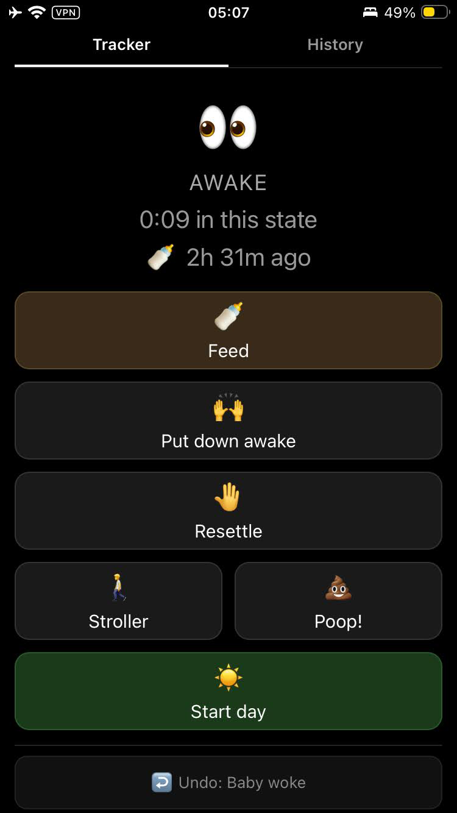
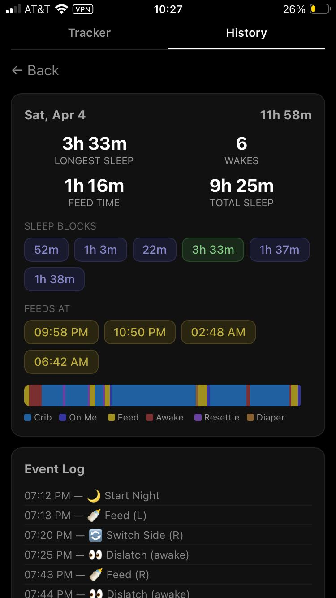
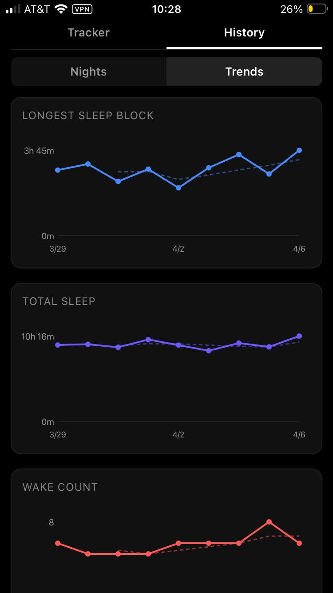

# Boob O'Clock

A nighttime baby sleep and feed tracker for breastfeeding parents. Built for one-handed use on a small phone screen.

Dark mode only. Single tap to record events. Long-press for time adjustments.

## Why I built this

I'm a new parent in the thick of newborn nights. At 3am, mid-feed, I genuinely could not remember which side and when I'd last fed on — and every baby tracker I found wanted an account, cloud sync, and a bright white screen in my face. So I vibecoded this for myself in a few evenings, and it's already been useful enough that I wanted to share it.

Just your data, on your network, in the dark. If Boob O'Clock helped you survive the infant nights, you can [buy me a coffee](https://ko-fi.com/polinaturcu) — it means a lot.

## What it tracks

The app models your night as a state machine. Depending on the current state, only the valid next actions are shown:

- **Feeds** — start, switch breast (auto-flips), dislatch (awake or asleep). Tracks left/right duration separately.
- **Sleep** — on me, in crib, in stroller. Tracks where the baby is sleeping.
- **Transfers** — crib transfer attempts with deferred outcome (tap result when hands are free).
- **Self-soothing** — baby put down awake or stirring in crib, settling without intervention.
- **Resettling** — in-crib settling without a feed.
- **Strolling** — the nuclear option when the crib isn't working.
- **Diaper changes** — because shit happens, at any time.
- **Ferber mode** — opt-in per night. Graduated check-in intervals (classic Ferber table), mood tracking (quiet / fussy / crying), and a countdown on the check-in button so you never check in too early. No-op when off; the rest of the app works exactly the same.

## What it reports

- Per-night summary: night duration, total sleep, total feed time, wake count, feed count, longest sleep block, individual sleep block durations, feed times
- Ferber nights also show sessions, average time to settle, cry time, fuss time, check-ins, abandoned sessions, and quiet time
- Color-coded timeline bar showing the night at a glance
- Full event log with timestamps
- Feed times scatter plot showing when feeds happen across nights
- Real bedtime chart showing when the baby actually goes down
- Trend charts with 3-night moving averages: longest sleep, total sleep, wake count, feed count, total feed time, feed time by breast (L/R)
- Ferber trend charts (when any night had Ferber on): cry time per night, check-ins per night, avg time to settle
- Ferber nights are highlighted as sage-green blocks on all non-Ferber trend charts, so you can correlate Ferber periods with broader sleep/feed changes
- CSV export for backup or analysis

## Screenshots

<p align="center">
  
  
  
</p>

## Deploy

### Docker Compose (recommended)

```bash
git clone https://github.com/liviro/boob-o-clock.git
cd boob-o-clock
docker compose up -d
```

That's it. The app is at `http://localhost:8080`.

To update:

```bash
docker compose build --no-cache
docker compose up -d
```

The SQLite database lives in a named Docker volume (`boc-data`) and survives rebuilds. Back it up with:

```bash
docker compose cp boob-o-clock:/data/boob-o-clock.db ./backup.db
```

### Docker (manual)

```bash
docker build -t boob-o-clock .
docker run -d \
  --name boob-o-clock \
  --restart unless-stopped \
  -p 8080:8080 \
  -v boc-data:/data \
  boob-o-clock
```

To change the port, set the `PORT` environment variable:

```bash
docker run -d -e PORT=9090 -p 9090:9090 -v boc-data:/data boob-o-clock
```

### Binary

Requires Go 1.25+ and Node 22+.

```bash
cd web && npm install && cd ..
make build
./boob-o-clock -addr :8080 -db ./boob-o-clock.db
```

### Access from your phone

Open `http://<your-server-ip>:8080` in Safari and tap **Share → Add to Home Screen**. The app launches fullscreen like a native app.

> **Note:** The PWA service worker requires HTTPS on non-localhost. For local network use, accessing via IP on HTTP works fine — you just won't get offline caching. To enable HTTPS, put a reverse proxy (Caddy, nginx) in front with a self-signed or Let's Encrypt cert.

## Develop

```bash
# Install frontend dependencies
cd web && npm install && cd ..

# Run Go backend on :8080 and Vite dev server on :5173
make dev

# Open http://localhost:5173 — hot reload for frontend, API proxied to Go
```

### Seed data

```bash
go run ./cmd/seed -db ./dev.db          # 8 nights of plausible data
go run ./cmd/server -addr :8080 -db ./dev.db
```

Generates completed and in-progress nights with varied scenarios: long stretches, multi-wake rough nights, stroller blocks, resettles, poop, breast alternation, and two Ferber nights (Night 1 with two settled sessions, Night 2 with a settled bedtime and an abandoned mid-night session falling back to feed-to-sleep).

### Test

```bash
make test              # Go tests (115 tests across 4 packages)
cd web && npx tsc      # TypeScript type check
cd web && npm run lint # ESLint (react-hooks rules)
```

### Project structure

```
├── cmd/server/          Entry point, wiring, embed
├── internal/
│   ├── domain/          State machine (13 states, 41 transitions, zero deps)
│   ├── store/           SQLite persistence (pure Go, no CGo)
│   ├── reports/         Stats, timelines, trends, breast tracking, Ferber session derivation
│   ├── api/             REST handlers
│   └── web/             Embedded frontend (go:embed)
└── web/                 Preact + TypeScript + Vite source
```

### API

| Method | Path | Description |
|--------|------|-------------|
| GET | `/api/session/current` | Current state + valid actions |
| POST | `/api/session/event` | Record an event |
| POST | `/api/session/undo` | Undo last event |
| GET | `/api/nights` | Night list with stats |
| GET | `/api/nights/:id` | Night detail with timeline |
| GET | `/api/trends` | Trend data with moving averages |
| GET | `/api/export/csv` | Download all events as CSV |
| GET | `/healthz` | Health check (DB ping) |

## License

MIT
